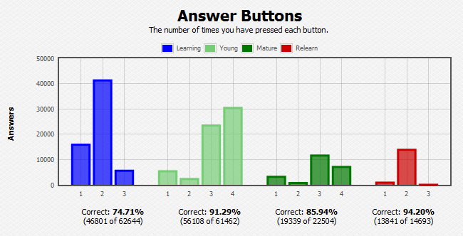

# Separate Learn and Relearn in the Answer Buttons graph

This add-on shows more detailled infomation about which buttons you pressed. There are separate graphics for learning, young, mature, and relearning cards.

## Warning

This is incompatible with [Progress Graphs and Stats for Learned and Matured Cards](https://ankiweb.net/shared/info/266436365)

## Version 2.0
https://ankiweb.net/shared/info/1999018922

## Links, licence and credits

Key         |Value
------------|-------------------------------------------------------------------
Maintener   | Arthur Milchior arthur@milchior.fr
Copyright   | Unknown. The original author left no way to contact them
Based on    | Anki code by Damien Elmes <anki@ichi2.net>
License     | GNU AGPL, version 3 or later; http://www.gnu.org/licenses/agpl.html
Source in   | https://github.com/Arthur-Milchior/anki-separate-buttons
Addon number| [403491806](https://ankiweb.net/shared/info/403491806)
